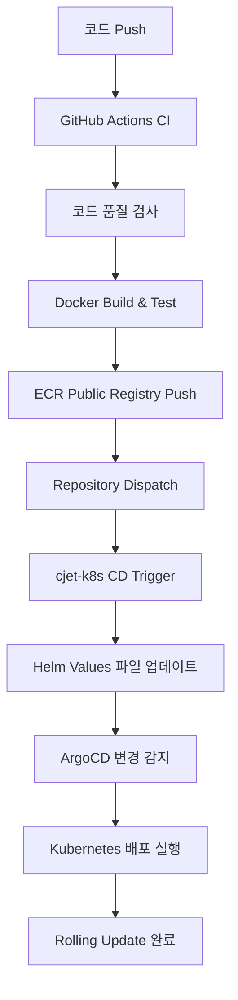

# 🚀 CloudJet Backend - 마이크로서비스 아키텍처

> **현대적인 항공편 예약 시스템의 백엔드 API**  
> Flask + Docker + Kubernetes + ArgoCD를 활용한 완전 자동화 GitOps 워크플로우

[](https://github.com/Cloud-Jet/cjet-backend-public/actions)
[](https://sonarcloud.io/dashboard?id=cloudjet-backend)

---

## 📋 **프로젝트 개요**

CloudJet은 현대적인 항공편 예약 시스템을 구축하기 위한 **마이크로서비스 아키텍처** 프로젝트입니다.  
현대적인 DevOps 방법론을 통해 완전 자동화된 CI/CD 파이프라인과 클라우드 네이티브 인프라를 제공합니다.

### 🎯 **핵심 특징**
- 🏗️ **현대적인 마이크로서비스**: 5개의 독립적인 서비스로 구성
- 🔄 **완전 자동화 CI/CD**: GitHub Actions + ArgoCD를 통한 GitOps 워크플로우  
- ☁️ **클라우드 네이티브**: AWS EKS + ECR + Istio 서비스 메시 활용
- 🔒 **엔터프라이즈 보안**: JWT 인증, 시크릿 관리, 보안 정책 적용
- 📊 **모니터링 & 로깅**: 프로메테우스 기반 완전 관측성

---

## 🏗️ **마이크로서비스 아키텍처**

### **서비스 구성**
```
┌─────────────────┐    ┌─────────────────┐    ┌─────────────────┐
│  Auth Service   │    │ Flight Service  │    │Booking Service  │
│     (5001)      │    │     (5002)      │    │     (5003)      │
└─────────────────┘    └─────────────────┘    └─────────────────┘
          │                        │                        │
          └────────────┬───────────────────┬─────────────────┘
                       │                   │
┌─────────────────┐    │    ┌─────────────────┐
│Payment Service  │    │    │  Admin Service  │
│     (5004)      │    │    │     (5005)      │
└─────────────────┘         └─────────────────┘
```

### **기술 스택**
| 분야 | 기술 스택 |
|------|-----------|
| **Runtime** | Python 3.11, Flask 2.3 |
| **Database** | MySQL 8.0, Redis 7.0 |
| **Container** | Docker, Kubernetes (EKS) |
| **Service Mesh** | Istio 1.27 |
| **CI/CD** | GitHub Actions, ArgoCD |
| **Cloud** | AWS (EKS, ECR, Secrets Manager) |
| **Monitoring** | Prometheus, Grafana, Jaeger |
| **Payment** | Bootpay API Integration |

---

## 🔧 **서비스 상세 설명**

### 🔐 **Auth Service (5001)**
- **기능**: 사용자 인증, JWT 토큰 발급, 권한 관리
- **주요 API**:
  - `POST /api/auth/login` - 사용자 로그인
  - `POST /api/auth/register` - 회원가입
  - `GET /api/auth/verify` - 토큰 검증

### ✈️ **Flight Service (5002)**
- **기능**: 항공편 검색, 좌석 정보 조회, 스케줄 관리
- **주요 API**:
  - `GET /api/flights/search` - 항공편 검색
  - `GET /api/flights/{id}/seats` - 좌석 조회
  - `GET /api/flights/schedule` - 운항 스케줄

### 📋 **Booking Service (5003)**
- **기능**: 예약 생성, 예약 관리, 예약 내역 조회
- **주요 API**:
  - `POST /api/bookings` - 예약 생성
  - `GET /api/bookings/{id}` - 예약 조회
  - `PUT /api/bookings/{id}/cancel` - 예약 취소

### 💳 **Payment Service (5004)**
- **기능**: 결제 처리, Bootpay 연동, 결제 내역 관리
- **주요 API**:
  - `POST /api/payments/initialize` - 결제 초기화
  - `POST /api/payments/webhook` - 결제 상태 웹훅
  - `GET /api/payments/{id}/status` - 결제 상태 조회

### 👨‍💼 **Admin Service (5005)**
- **기능**: 관리자 대시보드, 통계, 시스템 관리
- **주요 API**:
  - `GET /api/admin/stats` - 시스템 통계
  - `PUT /api/admin/flights/{id}` - 항공편 수정
  - `GET /api/admin/bookings` - 전체 예약 내역

---

## 🔄 **CI/CD 파이프라인**

### **완전 자동화 GitOps 워크플로우**


### **주요 특징**
- ⚡ **빠른 피드백**: 코드 품질 검사부터 배포까지 자동화
- 🛡️ **안전한 배포**: Kubernetes Rolling Update로 Zero-Downtime
- 📈 **배포 추적**: 실시간 배포 상태 모니터링 및 롤백 지원
- 🔒 **보안 검사**: Docker 이미지 취약점 스캔 후 배포 실행

---

## 🚀 **로컬 개발 환경 설정**

### **Prerequisites**
```bash
- Python 3.11+
- Docker & Docker Compose
- MySQL 8.0
- Redis 7.0
```

### **1. 프로젝트 클론**
```bash
git clone https://github.com/Cloud-Jet/cjet-backend-public.git
cd cjet-backend
```

### **2. 환경변수 설정**
```bash
# .env 파일 생성 (각 서비스별 설정 필요)
cp .env.example .env

# 필수 환경변수 설정
SECRET_KEY=your-jwt-secret-key
DB_HOST=localhost
DB_USER=cloudjet
DB_PASSWORD=your-database-password
DB_NAME=cloudjet
REDIS_HOST=localhost
REDIS_PASSWORD=your-redis-password
BOOTPAY_REST_API_KEY=your-bootpay-api-key
BOOTPAY_PRIVATE_KEY=your-bootpay-private-key
```

### **3. 데이터베이스 설정**
```bash
# MySQL 컨테이너 실행
docker run -d --name mysql-cloudjet \
    -e MYSQL_ROOT_PASSWORD=rootpassword \
    -e MYSQL_DATABASE=cloudjet \
    -e MYSQL_USER=cloudjet \
    -e MYSQL_PASSWORD=your-password \
    -p 3306:3306 mysql:8.0

# 스키마 생성
mysql -h localhost -u cloudjet -p cloudjet < sql/cloudjet_setup.sql
```

### **4. Redis 설정**
```bash
# Redis 컨테이너 실행
docker run -d --name redis-cloudjet \
    -p 6379:6379 \
    redis:7.0 redis-server --requirepass your-redis-password
```

### **5. 서비스 실행**
```bash
# 개별 서비스 실행 (예시)
cd auth-service
pip install -r requirements.txt
python app.py

# 또는 Docker Compose로 전체 실행
docker-compose up -d
```

---

## 🐳 **Docker 배포**

### **개별 서비스 빌드**
```bash
# 예시: Auth Service 빌드
cd auth-service
docker build -t cloudjet/auth-service:latest .
docker run -p 5001:5001 --env-file .env cloudjet/auth-service:latest
```

### **Docker Compose로 전체 실행**
```bash
docker-compose up -d
```

---

## ☸️ **Kubernetes 배포**

### **Helm 차트로 배포**
```bash
# cjet-k8s 레포지토리 클론
git clone https://github.com/Cloud-Jet/cjet-k8s-public.git
cd cjet-k8s

# 네임스페이스 생성
kubectl create namespace cloudjet

# Helm으로 배포
helm install cloudjet ./helm -n cloudjet
```

### **ArgoCD를 통한 GitOps 배포**
```bash
# ArgoCD Application 생성
argocd app create cloudjet-app \
    --repo https://github.com/Cloud-Jet/cjet-k8s-public.git \
    --path helm \
    --dest-server https://kubernetes.default.svc \
    --dest-namespace cloudjet \
    --sync-policy automated
```

---

## 📡 **API 사용법**

### **주요 엔드포인트**

#### **인증 API**
```bash
POST /api/auth/login
Content-Type: application/json

{
    "username": "user@example.com",
    "password": "password123"
}
```

#### **항공편 검색 API**
```bash
GET /api/flights/search?departure=ICN&arrival=NRT&date=2024-09-15
Authorization: Bearer <jwt-token>
```

#### **예약 생성 API**
```bash
POST /api/bookings
Authorization: Bearer <jwt-token>
Content-Type: application/json

{
    "schedule_id": 1,
    "seat_id": "12A",
    "passengers": [
        {
            "name": "홍길동",
            "birth_date": "1990-01-01",
            "phone": "010-1234-5678"
        }
    ]
}
```

전체 API 문서는 [Postman Collection](./docs/CloudJet-API.postman_collection.json)을 참고하세요.

---

## 🧪 **테스팅**

### **단위 테스트**
```bash
# 개별 서비스별 실행
python -m pytest tests/ -v --coverage
```

### **통합 테스트**
```bash
# Docker Compose를 통한 테스트 환경 구성
docker-compose -f docker-compose.test.yml up --abort-on-container-exit
```

### **API 테스트**
```bash
# Newman으로 Postman 컬렉션 실행
newman run docs/CloudJet-API.postman_collection.json \
    --environment docs/test-environment.json
```

---

## 🔒 **보안**

### **보안 구현사항**
- 🔐 **JWT 기반 인증**: Stateless 토큰 기반 인증 시스템
- 🌐 **CORS 설정**: 크로스 Cross-Origin 요청 제어
- 🔑 **환경변수 관리**: 민감한 정보를 환경변수로 분리
- 🛡️ **SQL Injection 방어**: Parameterized Query 사용
- 📦 **보안 스캔**: Trivy를 통한 컨테이너 취약점 검사

### **환경변수 보안**
```bash
# 민감한 정보는 절대로 코드에 하드코딩하지 않음
SECRET_KEY=                   # JWT 서명 키
DB_PASSWORD=                  # 데이터베이스 비밀번호
REDIS_PASSWORD=               # Redis 비밀번호
BOOTPAY_PRIVATE_KEY=         # 결제 API 비밀키
```

---

## 📊 **모니터링 & 로깅**

### **모니터링 스택**
- **Prometheus**: 메트릭 수집 및 모니터링
- **Grafana**: 대시보드 및 시각화
- **Istio**: 서비스 메시 기반 관측성

### **로깅**
- **구조화된 로깅**: JSON 형태의 로그 출력
- **분산 추적**: Jaeger를 통한 요청 추적
- **중앙화된 로그 관리**: ELK Stack 연동

### **헬스체크**
```bash
# 각 서비스의 헬스체크 엔드포인트
GET /api/auth/health              # Auth Service
GET /api/flights/health           # Flight Service
GET /api/bookings/health          # Booking Service
GET /api/payments/health          # Payment Service
GET /api/admin/health             # Admin Service
```

---

## ⚡ **성능 최적화**

### **캐시 전략**
- **Redis 캐시**: 항공편 검색 결과, 사용자 세션
- **Application Level**: 자주 조회되는 데이터 메모리 캐시
- **CDN**: 정적 파일 및 API 응답 캐싱

### **데이터베이스 최적화**
- **인덱스 최적화**: 검색 성능을 위한 적절한 인덱스
- **쿼리 최적화**: 데이터베이스 부하 최소화 쿼리
- **커넥션 풀 관리**: 조회 성능 향상

---

## 🤝 **기여 가이드라인**

### **개발 워크플로우**
1. **Fork** 및 **Clone**
2. **Feature Branch** 생성: `git checkout -b feature/amazing-feature`
3. **코드 작성** 및 **테스트 통과**
4. **Commit**: `git commit -m 'Add amazing feature'`
5. **Push**: `git push origin feature/amazing-feature`
6. **Pull Request** 생성

### **코드 스타일**
- **PEP 8** Python 스타일 가이드 준수
- **Black** 코드 포매터 사용
- **Pylint** 코드 품질 체크 도구
- **Type Hints** 타입 힌트 적용

---

## 📄 **라이선스**

이 프로젝트는 **MIT 라이선스** 하에 배포됩니다. 자세한 내용은 [LICENSE](LICENSE) 파일을 참고하세요.

---

## 📞 **연락처**

- **프로젝트 리포**: [https://github.com/Cloud-Jet/cjet-backend-public](https://github.com/Cloud-Jet/cjet-backend-public)
- **이슈 리포팅**: [GitHub Issues](https://github.com/Cloud-Jet/cjet-backend-public/issues)
- **문서**: [GitHub Wiki](https://github.com/Cloud-Jet/cjet-backend-public/wiki)

---

## 🗺️ **로드맵**

### **v1.0 (현재)**
- ✅ 기본 예약 시스템 구현
- ✅ CI/CD 파이프라인 구축
- ✅ Kubernetes 배포 완료

### **v1.1 (계획)**
- 🔄 고급 알림 기능 시스템
- 🔄 결제 시스템 확장
- 🔄 성능 모니터링 API 최적화

### **v2.0 (미래)**
- 🚀 AI 기반 가격 추천 
- 🚀 실시간 알림
- 🚀 마이크로프론트엔드 지원

---

**⭐ 이 프로젝트가 도움이 되셨다면 Star를 눌러주세요!** ⭐