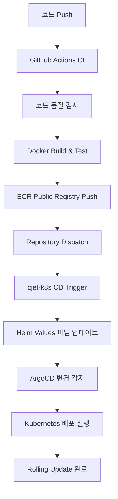

# 🚀 CloudJet Backend - 마이크로서비스 아키텍처

> **현대적인 항공편 예약 시스템의 백엔드 API**  
> Flask + Docker + Kubernetes + ArgoCD를 활용한 완전 자동화 GitOps 워크플로우

[](https://github.com/Cloud-Jet/cjet-backend-public/actions)
[](https://sonarcloud.io/project/overview?id=Cloud-Jet_cjet-backend-public)
[](https://sonarcloud.io/project/overview?id=Cloud-Jet_cjet-backend-public)
[](https://sonarcloud.io/project/overview?id=Cloud-Jet_cjet-backend-public)

---

## 📋 **프로젝트 개요**

CloudJet은 현대적인 항공편 예약 시스템을 구축하기 위한 **마이크로서비스 아키텍처** 프로젝트입니다.  
현대적인 DevOps 방법론을 통해 완전 자동화된 CI/CD 파이프라인과 클라우드 네이티브 인프라를 제공합니다.

### 🎯 **핵심 특징**
- 🏗️ **현대적인 마이크로서비스**: 5개의 독립적인 서비스로 구성
- 🔄 **완전 자동화 CI/CD**: GitHub Actions + ArgoCD를 통한 GitOps 워크플로우  
- ☁️ **클라우드 네이티브**: AWS EKS + ECR + Istio 서비스 메시 활용
- 🔒 **엔터프라이즈 보안**: JWT 인증, 시크릿 관리, 보안 정책 적용
- 📊 **코드 품질 관리**: SonarCloud 정적 분석 + 실시간 Slack 알림
- 📊 **완전한 관측성**: Prometheus + Grafana + Kiali + Jaeger + Loki 모니터링 스택

---

## 🏗️ **마이크로서비스 아키텍처**

### **서비스 구성**
```
┌─────────────────┐    ┌─────────────────┐    ┌─────────────────┐
│  Auth Service   │    │ Flight Service  │    │Booking Service  │
│     (5001)      │    │     (5002)      │    │     (5003)      │
└─────────────────┘    └─────────────────┘    └─────────────────┘
          │                        │                        │
          └────────────┬───────────────────┬─────────────────┘
                       │                   │
┌─────────────────┐    │    ┌─────────────────┐
│Payment Service  │    │    │  Admin Service  │
│     (5004)      │    │    │     (5005)      │
└─────────────────┘         └─────────────────┘
```

### **기술 스택**
| 분야 | 기술 스택 |
|------|-----------|
| **Runtime** | Python 3.11, Flask 2.3 |
| **Database** | MySQL 8.0, Redis 7.0 |
| **Container** | Docker, Kubernetes (EKS) |
| **Service Mesh** | Istio 1.27 |
| **CI/CD** | GitHub Actions, ArgoCD |
| **Registry** | AWS ECR Public Registry |
| **Cloud** | AWS (EKS, ECR, Secrets Manager) |
| **Code Quality** | SonarCloud, Slack Notifications |
| **Monitoring** | Prometheus, Grafana, Kiali, Jaeger, Loki |
| **Payment** | Bootpay API Integration |
| **Security** | JWT, External Secrets Operator |

---

## 🔧 **서비스 상세 설명**

### 🔐 **Auth Service (5001)**
- **기능**: JWT 기반 사용자 인증, 회원가입/로그인, 프로필 관리
- **주요 API**:
  - `POST /api/auth/signup` - 회원가입
  - `POST /api/auth/login` - 로그인
  - `GET /api/auth/profile` - 사용자 프로필 조회
  - `PUT /api/auth/profile` - 사용자 프로필 수정
  - `GET /api/auth/health` - 헬스체크

### ✈️ **Flight Service (5002)**
- **기능**: 항공편 검색 (Redis 캐싱), 공항 정보, 특가/프로모션 조회
- **주요 API**:
  - `GET /api/flights/search` - 항공편 검색 (캐시 적용)
  - `GET /api/flights/airports` - 공항 목록
  - `GET /api/flights/featured` - 특가 항공편
  - `GET /api/flights/promotions` - 프로모션 조회
  - `GET /api/flights/health` - 헬스체크

### 📋 **Booking Service (5003)**
- **기능**: 예약 생성, 예약 관리, 좌석 점유 조회
- **주요 API**:
  - `POST /api/bookings` - 예약 생성 (JWT 인증 필요)
  - `GET /api/bookings` - 사용자 예약 목록
  - `POST /api/bookings/{booking_number}/cancel` - 예약 취소
  - `GET /api/bookings/occupied-seats/{schedule_id}` - 좌석 점유 현황
  - `GET /api/bookings/health` - 헬스체크

### 💳 **Payment Service (5005)**
- **기능**: Bootpay 결제 초기화, 웹훅 처리, 예약-결제 연결
- **주요 API**:
  - `POST /api/payments/init` - 결제 초기화 (JWT 인증 필요)
  - `POST /api/payments/webhook` - Bootpay 웹훅 처리
  - `POST /api/payments/attach-booking` - 예약-결제 연결
  - `GET /api/payments/health` - 헬스체크

### 👨‍💼 **Admin Service (5004)**
- **기능**: 관리자 전용 항공편/예약/할인 관리 (admin_required 인증)
- **주요 API**:
  - `GET /api/admin/flights` - 모든 항공편 조회
  - `POST /api/admin/flights` - 항공편 추가
  - `POST /api/admin/flights-with-schedules` - 스케줄과 함께 항공편 추가
  - `DELETE /api/admin/flights/{flight_id}` - 항공편 삭제
  - `GET /api/admin/schedules` - 스케줄 관리
  - `GET /api/admin/bookings` - 전체 예약 관리
  - `GET /api/admin/bookings/search` - 예약 검색
  - `PUT /api/admin/bookings/{booking_number}/cancel` - 관리자 예약 취소
  - `GET/POST/DELETE /api/admin/discounts` - 할인 관리
  - `GET /api/admin/health` - 헬스체크

---

## 🔄 **CI/CD 파이프라인**

### **완전 자동화 GitOps 워크플로우**


### **주요 특징**
- ⚡ **빠른 피드백**: 코드 품질 검사부터 배포까지 자동화
- 🛡️ **안전한 배포**: Kubernetes Rolling Update로 Zero-Downtime
- 📈 **배포 추적**: 실시간 배포 상태 모니터링 및 롤백 지원
- 🔒 **보안 검사**: Docker 이미지 취약점 스캔 후 배포 실행

---

## 🚀 **로컬 개발 환경 설정**

### **Prerequisites**
```bash
- Python 3.11+
- Docker & Docker Compose
- MySQL 8.0
- Redis 7.0
```

### **1. 프로젝트 클론**
```bash
git clone https://github.com/Cloud-Jet/cjet-backend-public.git
cd cjet-backend-public
```

### **2. 환경변수 설정**
```bash
# 각 서비스별 환경변수 설정
# auth-service/.env
SECRET_KEY=your-jwt-secret-key
DB_HOST=localhost
DB_USER=cloudjet_user
DB_PASSWORD=cloudjet_pass
DB_NAME=cloudjet_airline
REDIS_HOST=localhost
REDIS_PORT=6379

# payment-service/.env
BOOTPAY_REST_API_KEY=your-bootpay-api-key
BOOTPAY_PRIVATE_KEY=your-bootpay-private-key
```

### **3. 데이터베이스 설정**
```bash
# MySQL 컨테이너 실행
docker run -d --name mysql-cloudjet \
    -e MYSQL_ROOT_PASSWORD=rootpassword \
    -e MYSQL_DATABASE=cloudjet_airline \
    -e MYSQL_USER=cloudjet_user \
    -e MYSQL_PASSWORD=cloudjet_pass \
    -p 3306:3306 mysql:8.0

# 데이터베이스 스키마 생성 (MySQL Workbench 또는 CLI에서 순서대로 실행)
# sql/01-database-setup.sql      # 데이터베이스 생성
# sql/02-basic-tables.sql        # 기본 테이블
# sql/03-flight-booking-tables.sql  # 항공편/예약 테이블
# sql/04-system-tables.sql       # 시스템 테이블
# sql/05-basic-data.sql          # 기본 데이터
# sql/06-sample-data.sql         # 샘플 데이터
# sql/07-views-indexes.sql       # 뷰 및 인덱스

# 자세한 설정은 sql/README.md 참조
```

### **4. Redis 설정**
```bash
# Redis 컨테이너 실행 (비밀번호 없이)
docker run -d --name redis-cloudjet \
    -p 6379:6379 \
    redis:7.0
```

### **5. 서비스 실행**
```bash
# 개별 서비스 실행 (예시: Auth Service)
cd auth-service
pip install -r requirements.txt
python app.py

# 다른 터미널에서 다른 서비스들 실행
cd flight-service && python app.py   # 포트 5002
cd booking-service && python app.py  # 포트 5003
cd admin-service && python app.py    # 포트 5004
cd payment-service && python app.py  # 포트 5005

# 전체 헬스체크
curl http://localhost:5001/api/auth/health
curl http://localhost:5002/api/flights/health
curl http://localhost:5003/api/bookings/health
curl http://localhost:5004/api/admin/health
curl http://localhost:5005/api/payments/health
```

---

## 🐳 **Docker 배포**

### **개별 서비스 빌드**
```bash
# 예시: Auth Service 빌드
cd auth-service
docker build -t cloudjet/auth-service:latest .
docker run -p 5001:5001 --env-file .env cloudjet/auth-service:latest
```

### **Docker Compose로 전체 실행**
```bash
docker-compose up -d
```

---

## ☸️ **Kubernetes 배포**

### **Helm 차트로 배포**
```bash
# cjet-k8s 레포지토리 클론
git clone https://github.com/Cloud-Jet/cjet-k8s-public.git
cd cjet-k8s

# 네임스페이스 생성
kubectl create namespace cloudjet

# Helm으로 배포
helm install cloudjet ./helm -n cloudjet
```

### **ArgoCD를 통한 GitOps 배포**
```bash
# ArgoCD Application 생성
argocd app create cloudjet-app \
    --repo https://github.com/Cloud-Jet/cjet-k8s-public.git \
    --path helm \
    --dest-server https://kubernetes.default.svc \
    --dest-namespace cloudjet \
    --sync-policy automated
```

---

## 📡 **API 사용법**

### **주요 엔드포인트**

#### **인증 API**
```bash
POST /api/auth/login
Content-Type: application/json

{
    "username": "user@example.com",
    "password": "password123"
}
```

#### **항공편 검색 API**
```bash
GET /api/flights/search?departure=ICN&arrival=NRT&date=2024-09-15
Authorization: Bearer <jwt-token>
```

#### **예약 생성 API**
```bash
POST /api/bookings
Authorization: Bearer <jwt-token>
Content-Type: application/json

{
    "schedule_id": 1,
    "seat_id": "12A",
    "passengers": [
        {
            "name": "홍길동",
            "birth_date": "1990-01-01",
            "phone": "010-1234-5678"
        }
    ]
}
```

전체 API 문서는 [Postman Collection](./docs/CloudJet-API.postman_collection.json)을 참고하세요.

---

## 🧪 **테스팅**

### **단위 테스트**
```bash
# 개별 서비스별 실행
python -m pytest tests/ -v --coverage
```

### **통합 테스트**
```bash
# Docker Compose를 통한 테스트 환경 구성
docker-compose -f docker-compose.test.yml up --abort-on-container-exit
```

### **API 테스트**
```bash
# Newman으로 Postman 컬렉션 실행
newman run docs/CloudJet-API.postman_collection.json \
    --environment docs/test-environment.json
```

---

## 🔒 **보안**

### **보안 구현사항**
- 🔐 **JWT 기반 인증**: Stateless 토큰 기반 인증 시스템
- 🌐 **CORS 설정**: 크로스 Cross-Origin 요청 제어
- 🔑 **환경변수 관리**: 민감한 정보를 환경변수로 분리
- 🛡️ **SQL Injection 방어**: Parameterized Query 사용
- 📦 **보안 스캔**: Trivy를 통한 컨테이너 취약점 검사

### **환경변수 보안**
```bash
# 민감한 정보는 절대로 코드에 하드코딩하지 않음
SECRET_KEY=                   # JWT 서명 키
DB_PASSWORD=                  # 데이터베이스 비밀번호
REDIS_PASSWORD=               # Redis 비밀번호
BOOTPAY_PRIVATE_KEY=         # 결제 API 비밀키
```

---

## 📊 **코드 품질 관리**

### **SonarCloud 정적 분석**
- **품질 게이트**: PR 머지 전 자동 코드 품질 검증
- **보안 스캔**: OWASP Top 10 기반 취약점 검사
- **코드 커버리지**: 단위 테스트 커버리지 추적
- **기술 부채**: 유지보수성 및 복잡도 측정
- **실시간 모니터링**: [SonarCloud 대시보드](https://sonarcloud.io/project/overview?id=Cloud-Jet_cjet-backend-public)

### **품질 메트릭**
```bash
# 로컬에서 SonarQube 스캔 실행
sonar-scanner \
  -Dsonar.projectKey=Cloud-Jet_cjet-backend-public \
  -Dsonar.organization=cloud-jet \
  -Dsonar.host.url=https://sonarcloud.io \
  -Dsonar.login=$SONAR_TOKEN
```

### **Slack 통합 알림**
- **채널**: `#ci-cd-alerts`
- **알림 이벤트**:
  - ✅ 빌드 성공/실패
  - 📊 SonarCloud 품질 검사 결과
  - 🚀 배포 상태 (성공/실패/롤백)
  - ⚠️ 품질 게이트 실패 알림

### **GitHub Secrets 설정**
```yaml
# 필수 환경변수
SLACK_WEBHOOK_URL: https://hooks.slack.com/services/YOUR/SLACK/WEBHOOK
SONAR_TOKEN: your-sonarcloud-token
```

---

## 📊 **모니터링 & 관측성**

### **완전한 모니터링 스택 (K8s 배포)**

#### **📈 Prometheus + Grafana**
- **Prometheus**: 메트릭 수집 및 저장 (15일 보존, 20GB 스토리지)
- **Grafana**: 대시보드 및 시각화 (Loki 데이터소스 연동)
- **Alertmanager**: 알림 및 경고 관리
- **Node Exporter**: 노드 메트릭 수집
- **실시간 모니터링**: CPU, 메모리, 트래픽, 에러율

#### **🕸️ Kiali (Service Mesh 관측성)**
- **서비스 토폴로지**: 마이크로서비스 간 통신 시각화
- **트래픽 플로우**: 요청 흐름 및 성공/실패율
- **Istio 설정 검증**: VirtualService, DestinationRule 확인
- **실시간 트래픽**: user/admin 네임스페이스 모니터링

#### **🔍 Jaeger (분산 추적)**
- **All-in-One 배포**: 메모리 기반 트레이스 저장 (50,000 traces)
- **분산 추적**: 마이크로서비스 간 요청 추적
- **성능 분석**: 레이턴시, 병목 지점 식별
- **에러 추적**: 실패한 요청의 상세 분석

#### **📝 Loki (로그 집계)**
- **AWS S3 백엔드**: cloudjet-loki-storage 버킷 사용
- **로그 보존**: 168시간 (7일) 보존 정책
- **구조화된 로그**: JSON 로그 수집 및 쿼리
- **IAM 연동**: loki-irsa-role을 통한 AWS 권한 관리

### **접근 URL (Istio VirtualService)**
```bash
# K8s 클러스터 내부 접근
https://grafana.cloudjet.click      # Grafana 대시보드
https://kiali.cloudjet.click        # Kiali 서비스 메시
https://jaeger.cloudjet.click       # Jaeger 분산 추적
https://prometheus.cloudjet.click   # Prometheus 메트릭
```

### **서비스별 헬스체크 엔드포인트**
```bash
# 각 마이크로서비스의 상태 확인
GET /api/auth/health              # Auth Service (포트 5001)
GET /api/flights/health           # Flight Service (포트 5002)
GET /api/bookings/health          # Booking Service (포트 5003)
GET /api/admin/health             # Admin Service (포트 5004)
GET /api/payments/health          # Payment Service (포트 5005)
```

### **메트릭 수집**
- **Istio 메트릭**: 서비스 메시 트래픽, 성공률, 레이턴시
- **비즈니스 메트릭**: 예약 수, 결제 성공률, 사용자 활동
- **인프라 메트릭**: Kubernetes 클러스터, 노드 상태

---

## ⚡ **성능 최적화**

### **캐시 전략**
- **Redis 캐시**: 항공편 검색 결과 (5분 TTL), 사용자 세션 관리

### **데이터베이스 최적화**
- **커넥션 풀**: MySQL 커넥션 풀 관리로 성능 최적화
- **인덱스 최적화**: SQL 스키마에 검색 성능 인덱스 구현
- **쿼리 최적화**: Parameterized Query로 SQL Injection 방어 및 성능 향상

---

## 🤝 **기여 가이드라인**

### **개발 워크플로우**
1. **Fork** 및 **Clone**
2. **Feature Branch** 생성: `git checkout -b feature/amazing-feature`
3. **코드 작성** 및 **테스트 통과**
4. **Commit**: `git commit -m 'Add amazing feature'`
5. **Push**: `git push origin feature/amazing-feature`
6. **Pull Request** 생성

### **코드 스타일**
- **PEP 8** Python 스타일 가이드 준수
- **Black** 코드 포매터 사용
- **Pylint** 코드 품질 체크 도구
- **Type Hints** 타입 힌트 적용

---

## 📄 **라이선스**

이 프로젝트는 **MIT 라이선스** 하에 배포됩니다. 자세한 내용은 [LICENSE](LICENSE) 파일을 참고하세요.

---

## 📞 **연락처**

- **프로젝트 리포**: [https://github.com/Cloud-Jet/cjet-backend-public](https://github.com/Cloud-Jet/cjet-backend-public)
- **이슈 리포팅**: [GitHub Issues](https://github.com/Cloud-Jet/cjet-backend-public/issues)
- **문서**: [GitHub Wiki](https://github.com/Cloud-Jet/cjet-backend-public/wiki)

---

## 🗺️ **로드맵**

### **v1.0 (현재)**
- ✅ 기본 예약 시스템 구현
- ✅ CI/CD 파이프라인 구축
- ✅ Kubernetes 배포 완료

### **v1.1 (계획)**
- 🔄 고급 알림 기능 시스템
- 🔄 결제 시스템 확장
- 🔄 성능 모니터링 API 최적화

### **v2.0 (미래)**
- 🚀 AI 기반 가격 추천 
- 🚀 실시간 알림
- 🚀 마이크로프론트엔드 지원

---

**⭐ 이 프로젝트가 도움이 되셨다면 Star를 눌러주세요!** ⭐